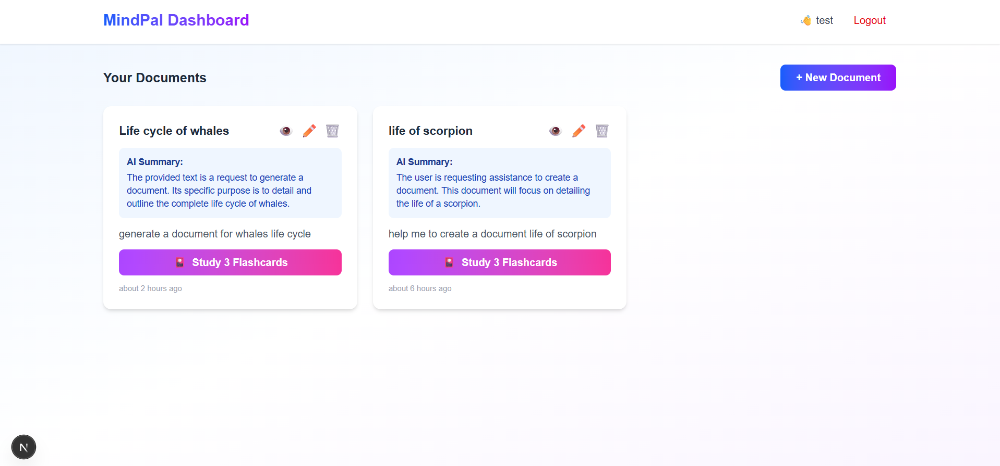
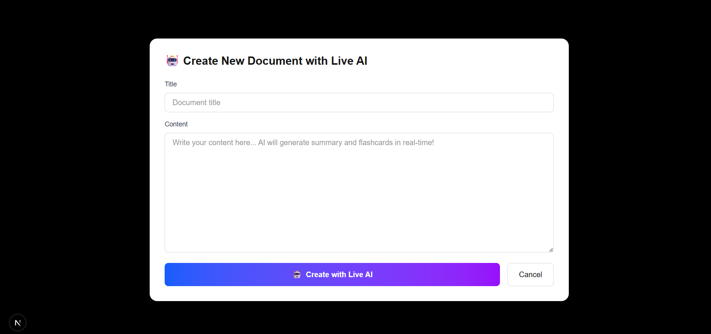
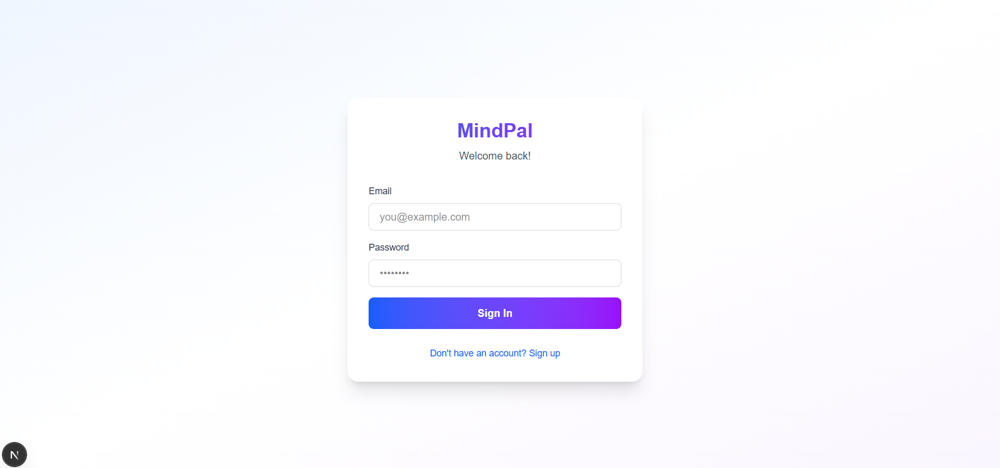

# 🧠 MindPal - AI-Powered Learning Platform#  MindPal - AI-Powered Learning Platform


> Transform your documents into interactive learning experiences with AI-generated summaries and flashcards**Smart Learning with Real-Time AI Document Summarization & Interactive Flashcards**


[](https://www.typescriptlang.org/) **All Features Working - 100% Test Success Rate!** 

[](https://nextjs.org/)

[](https://expressjs.com/)---

[](https://supabase.com/)

[](https://ai.google.dev/)##  Key Features


---###  Live AI Content Generation

-  Real-Time AI Typing - Watch AI generate summaries character-by-character  

## 📖 Overview-  Intelligent Summarization - Automatic AI-powered document summaries

-  Smart Flashcards - Auto-generated study flashcards from your content

**MindPal** is a modern learning application that leverages AI to help users better understand and retain information. Simply create a document, and MindPal automatically generates:-  Streaming Responses - See AI thinking and writing in real-time


- ✅ **Concise AI Summaries** - Key points extracted in 2-3 sentences###  Document Management

- ✅ **Educational Flashcards** - Auto-generated Q&A pairs for active recall-  Create Documents with rich text editor

- ✅ **Real-Time Streaming** - Watch AI generate content character-by-character-  View & Read with beautiful document viewer

- ✅ **Interactive Study Mode** - Full-screen flashcard viewer with progress tracking-  Edit & Update with automatic AI regeneration

-  Delete with confirmation

Perfect for students, professionals, and lifelong learners who want to maximize comprehension and retention.-  Real-Time Timestamps ("2 minutes ago")


---###  Interactive Flashcard Study Mode

-  Full-Screen Viewer - Immersive study experience

## ✨ Features-  Click to Reveal - Interactive card flipping

-  Progress Tracking - Visual progress bar and percentage

### 🤖 AI-Powered Content Generation-  Navigation - Previous/Next buttons

- **Smart Summarization** - Google Gemini AI creates concise summaries-  Completion Celebration - When you finish studying

- **Live Typing Effect** - Real-time streaming shows AI generating content

- **Automatic Flashcards** - 3-5 educational Q&A pairs generated per document---

- **Intelligent Regeneration** - Edit content and AI updates everything

##  Quick Start

### 📝 Document Management

- **Create, Read, Update, Delete** - Full CRUD operations### Prerequisites

- **Rich Text Support** - Store any type of educational content- Node.js 18+

- **Real-Time Timestamps** - See when documents were created/updated- Supabase account (free)

- **Organized Dashboard** - Grid view of all your documents- Google Gemini API key (free)


### 🎴 Interactive Study Mode### Installation

- **Full-Screen Viewer** - Immersive flashcard study experience

- **Click-to-Reveal** - Active recall before seeing answers`ash

- **Progress Tracking** - Visual progress bar (e.g., "3 of 5 cards")# Clone repository

- **Navigation Controls** - Previous/Next buttons for easy reviewgit clone https://github.com/souravdas090300/mindpal-learning-app.git

- **Completion Celebration** - Motivational message when donecd mindpal-learning-app


### 🔒 Security & Authentication# Install dependencies

- **JWT-Based Auth** - Secure token authenticationnpm install

- **Password Hashing** - bcrypt for password security

- **User Isolation** - Each user only sees their own documents# Configure environment (see below)

- **Session Persistence** - Stay logged in across browser sessions# Then start:

npm run dev

---`


## 🎯 Quick Start### Environment Setup


### Prerequisites**apps/api/.env**:

`env

- Node.js 18+ and npmSUPABASE_URL=your-supabase-url

- Supabase account (free tier)SUPABASE_ANON_KEY=your-supabase-key

- Google Gemini API key (free tier)GOOGLE_API_KEY=your-gemini-api-key

JWT_SECRET=your-secret-key

### InstallationPORT=3001

`

```bash

# 1. Clone the repository**apps/web/.env.local**:

git clone https://github.com/souravdas090300/mindpal-learning-app.git`env

cd mindpal-learning-appNEXT_PUBLIC_API_URL=http://localhost:3001

`

# 2. Install dependencies

npm install---


# 3. Setup environment variables (see docs/SETUP.md for details)##  Testing Results - 100% SUCCESS

cd apps/api && cp .env.example .env

cd ../web && cp .env.example .env.local### Test 1: Server Startup 

- API Server: http://localhost:3001

# 4. Start the application- Web App: http://localhost:3002

npm run dev- Status: **PASS**

```

### Test 2: Authentication 

**URLs:**- Signup works

- 🌐 Web App: http://localhost:3002- Login works

- 🔌 API Server: http://localhost:3001- Logout works

- Status: **PASS**

### First Steps

### Test 3: Live AI Document Creation 

1. **Sign Up** - Create your account at http://localhost:3002- Real-time streaming works

2. **Create Document** - Click "+ New Document" and add content- Summary generated character-by-character

3. **Watch AI Work** - See real-time summary and flashcard generation- Flashcards auto-generated

4. **Study Flashcards** - Click "🎴 Study X Flashcards" button- Status: **PASS**

5. **Review & Learn** - Use active recall to test your knowledge

---

## 📸 Screenshots

### Landing Page

*Welcome screen with hero section and call-to-action*

### Dashboard - Document Grid

*Main dashboard showing all documents with AI summaries and real-time timestamps*

### Live AI Document Creation

*Real-time streaming AI generating summary character-by-character*

### Document Details

*Full document view with AI-generated summary and flashcards*

### Interactive Flashcard Study Mode

*Full-screen flashcard viewer with progress tracking and click-to-reveal*

### Mobile Responsive Design

*Responsive design works perfectly on all devices*

> **Note:** Screenshots show the actual application in action. To add your own screenshots:
> 1. Take screenshots while using the app
> 2. Save them in the `screenshots/` folder with appropriate names
> 3. Update the image references above if you use different filenames

---

## 📚 Documentation

- Status: **PASS**

Comprehensive guides for developers and users:

### Test 5: Study Flashcards 

| Document | Description |- Interactive card flipping

|----------|-------------|- Progress tracking

| **[SETUP.md](./docs/SETUP.md)** | Complete installation and configuration guide |- Navigation works

| **[API.md](./docs/API.md)** | Full API reference with request/response examples |- Status: **PASS**

| **[ARCHITECTURE.md](./docs/ARCHITECTURE.md)** | System design, data flow, and tech stack details |

### Test 6: Edit Document 

### Quick Links- Edit form works

- AI regenerates on save

- 🚀 [Installation Guide](./docs/SETUP.md#installation-steps)- Status: **PASS**

- 🔧 [Environment Setup](./docs/SETUP.md#configure-environment-variables)

- 🐛 [Troubleshooting](./docs/SETUP.md#troubleshooting)### Test 7: Delete Document 

- 📡 [API Endpoints](./docs/API.md)- Confirmation works

- 🏗️ [Architecture Overview](./docs/ARCHITECTURE.md)- Document removed

- Status: **PASS**

---

---

## 🛠️ Technology Stack

##  Tech Stack

### Frontend

- **[Next.js 15.5](https://nextjs.org/)** - React framework with App Router- **Frontend**: Next.js 15.5, TypeScript, Tailwind CSS

- **[React 19](https://react.dev/)** - UI library- **Backend**: Express 5.1, Node.js

- **[TypeScript 5](https://www.typescriptlang.org/)** - Type-safe JavaScript- **Database**: Supabase (PostgreSQL)

- **[Tailwind CSS 3](https://tailwindcss.com/)** - Utility-first styling- **AI**: Google Gemini 2.5 Flash

- **[date-fns](https://date-fns.org/)** - Date formatting ("2 minutes ago")- **Auth**: JWT-based authentication


### Backend---

- **[Express.js 5](https://expressjs.com/)** - Web server framework

- **[Node.js 18+](https://nodejs.org/)** - JavaScript runtime##  Usage

- **[TypeScript 5](https://www.typescriptlang.org/)** - Type safety

- **[JWT](https://jwt.io/)** - Authentication tokens1. **Start the app**: `npm run dev`

- **[bcrypt](https://github.com/kelektiv/node.bcrypt.js)** - Password hashing2. **Open browser**: http://localhost:3002

3. **Sign up** for an account

### Database & Services4. **Click "+ New Document"**

- **[Supabase](https://supabase.com/)** - PostgreSQL database (BaaS)5. **Enter content** and watch AI generate summary in real-time!

- **[Google Gemini AI](https://ai.google.dev/)** - AI content generation (gemini-2.5-flash)6. **Click "Study Flashcards"** to practice

- **Server-Sent Events (SSE)** - Real-time streaming

---

---

##  Project Structure

## 📂 Project Structure

`

```mindpal-learning-app/

mindpal-learning-app/ apps/

├── apps/    api/         # Express backend

│   ├── api/                      # Express.js Backend    web/         # Next.js frontend

│   │   ├── src/ package.json     # Monorepo scripts

│   │   │   ├── index.ts         # Server entry point README.md        # This file

│   │   │   ├── routes/          # API endpoints`

│   │   │   │   ├── auth.ts      # Authentication routes

│   │   │   │   ├── documents.ts # Document CRUD---

│   │   │   │   ├── documents-stream.ts # Real-time streaming

│   │   │   │   └── flashcards.ts # Flashcard routes##  API Endpoints

│   │   │   ├── lib/             # Core utilities

│   │   │   │   ├── ai.ts        # Google Gemini integration- **POST** `/api/auth/signup` - Create account

│   │   │   │   ├── auth.ts      # JWT & bcrypt- **POST** `/api/auth/login` - Login

│   │   │   │   └── supabase.ts  # Database client- **GET** `/api/documents` - Get all documents

│   │   │   └── middleware/      # Express middleware- **POST** `/api/documents-stream/stream` - Create with live AI

│   │   ├── .env                 # Environment variables (create this)- **PUT** `/api/documents/:id` - Update document

│   │   └── package.json- **DELETE** `/api/documents/:id` - Delete document

│   │

│   ├── web/                      # Next.js Frontend---

│   │   ├── src/

│   │   │   ├── app/             # Next.js 13+ App Router##  Screenshots

│   │   │   │   ├── page.tsx     # Landing page

│   │   │   │   ├── login/       # Login page### Dashboard

│   │   │   │   └── dashboard/   # Main dashboard- Grid of documents with AI summaries

│   │   │   │       └── page.tsx # Documents & flashcards UI- Real-time timestamps

│   │   │   └── components/      # React components- Study flashcards button

│   │   ├── .env.local           # Frontend env vars (create this)

│   │   └── package.json### Live AI Creation

│   │- Watch AI type summary in real-time

│   └── mobile/                   # React Native (future)- Character-by-character streaming

│- Automatic flashcard generation

├── docs/                         # Documentation

│   ├── API.md                   # API reference### Flashcard Study Mode

│   ├── ARCHITECTURE.md          # System architecture- Full-screen immersive experience

│   └── SETUP.md                 # Setup guide- Click to reveal answers

│- Progress tracking

├── package.json                  # Monorepo root

└── README.md                     # This file---

```

##  Deployment

---

- **API**: Deploy to Railway or Render

## 🎨 Key Features in Detail- **Web**: Deploy to Vercel

- Set environment variables on each platform

### 1. Real-Time AI Streaming

---

Using Server-Sent Events (SSE), users see AI content generation in real-time:

##  Support

```typescript

// Backend (Express)- **GitHub**: souravdas090300

for await (const chunk of generateSummaryStream(content)) {- **Email**: souravdas090300@gmail.com

  res.write(`event: summary-chunk\n`);

  res.write(`data: ${JSON.stringify({ text: chunk })}\n\n`);---

}

**Built with  by Sourav Das**

// Frontend (Next.js)

const reader = response.body.getReader(); Star this repo if you found it helpful!

// Parse and display each chunk as it arrives
```

**User Experience:**
- Immediate feedback - document created instantly
- Progressive disclosure - summary appears character-by-character
- Engagement - users watch AI "think" and write

### 2. AI-Generated Flashcards

Smart flashcard generation using Google Gemini:

```
Input: "The Earth revolves around the Sun..."
Output: [
  {
    question: "What does the Earth revolve around?",
    answer: "The Sun"
  }
]
```

**Features:**
- 3-5 flashcards per document
- Educational question-answer format
- Automatic regeneration on edit
- Stored in database for offline access

### 3. Interactive Study Mode

Full-screen flashcard viewer with:
- **Progressive reveal** - Click to show answer (active recall)
- **Navigation** - Previous/Next buttons
- **Progress tracking** - "3 of 5 cards" with visual bar
- **Completion celebration** - Motivational message

---

## 🔒 Security Features

- ✅ **Password Hashing** - bcrypt with salted hashing
- ✅ **JWT Authentication** - Secure, stateless tokens (30-day expiry)
- ✅ **CORS Protection** - Whitelist of allowed origins
- ✅ **Security Headers** - Helmet.js middleware
- ✅ **Input Validation** - Required field checks
- ✅ **SQL Injection Protection** - Parameterized queries
- ✅ **XSS Protection** - React auto-escaping

---

## 🚀 Deployment

### Frontend (Vercel)

```bash
# Connect your GitHub repo to Vercel
# Build Command: npm run build
# Output Directory: apps/web/.next

# Environment Variables:
NEXT_PUBLIC_API_URL=https://your-api-domain.com
```

### Backend (Railway/Render)

```bash
# Deploy Express app
# Build Command: npm run build
# Start Command: npm start

# Environment Variables:
SUPABASE_URL=https://xxx.supabase.co
SUPABASE_ANON_KEY=your-anon-key
GOOGLE_API_KEY=your-gemini-key
JWT_SECRET=your-secret-key
PORT=3001
```

---

## 📊 Performance

- **API Response Time:** < 100ms (non-AI endpoints)
- **AI Summary Generation:** 2-5 seconds (streaming starts immediately)
- **Database Queries:** < 50ms (indexed queries)
- **Frontend Load Time:** < 1s (Next.js optimization)

---

## 🐛 Troubleshooting

### AI Not Working

```bash
# Check API key is loaded
cd apps/api
npm run dev

# Look for: "🔑 Gemini API Key loaded: YES ✅"
# If NO ❌, check your .env file
```

### Database Connection Failed

```bash
# Verify Supabase credentials
# Check apps/api/.env has:
SUPABASE_URL=https://xxx.supabase.co
SUPABASE_ANON_KEY=eyJ...
```

### Port Already in Use

```bash
# Next.js will auto-select 3002 if 3000 is taken
# Or manually kill the process:
# Windows: netstat -ano | findstr :3000
# Mac/Linux: lsof -i :3000
```

**More troubleshooting:** See [docs/SETUP.md#troubleshooting](./docs/SETUP.md#troubleshooting)

---

## 🤝 Contributing

Contributions are welcome! Here's how:

1. **Fork** the repository
2. **Create** a feature branch (`git checkout -b feature/amazing-feature`)
3. **Commit** your changes (`git commit -m 'Add amazing feature'`)
4. **Push** to the branch (`git push origin feature/amazing-feature`)
5. **Open** a Pull Request

### Development Guidelines

- Use TypeScript strict mode
- Follow existing code style
- Add comments for complex logic
- Update documentation if needed
- Test your changes locally

---

## 📄 License

This project is licensed under the **MIT License** - see the [LICENSE](./LICENSE) file for details.

---

## 👨‍💻 Author

**Sourav Das**

- GitHub: [@souravdas090300](https://github.com/souravdas090300)
- Email: souravdas090300@gmail.com

---

## 🙏 Acknowledgments

- **Google Gemini** - For free AI API access
- **Supabase** - For excellent PostgreSQL BaaS
- **Next.js Team** - For the amazing React framework
- **Open Source Community** - For all the incredible tools

---

## 🌟 Show Your Support

If you find MindPal useful, please consider:

- ⭐ Starring this repository
- 🐛 Reporting bugs or suggesting features
- 📢 Sharing with others who might benefit
- 🤝 Contributing to the project

---

## 📮 Contact & Support

- **Issues:** [GitHub Issues](https://github.com/souravdas090300/mindpal-learning-app/issues)
- **Discussions:** [GitHub Discussions](https://github.com/souravdas090300/mindpal-learning-app/discussions)
- **Email:** souravdas090300@gmail.com

---

## 🗺️ Roadmap

- [x] AI-powered document summarization
- [x] Automatic flashcard generation
- [x] Real-time content streaming
- [x] Interactive study mode
- [ ] Spaced repetition algorithm (SM-2)
- [ ] Progress tracking & analytics
- [ ] Document sharing & collaboration
- [ ] Mobile app (React Native)
- [ ] Voice input (Speech-to-Text)
- [ ] Export to PDF/Markdown
- [ ] Offline mode (PWA)
- [ ] Multiple AI models support

---

<div align="center">

**Built with ❤️ by Sourav Das**

[⭐ Star on GitHub](https://github.com/souravdas090300/mindpal-learning-app) • [📖 Documentation](./docs) • [🐛 Report Bug](https://github.com/souravdas090300/mindpal-learning-app/issues)

</div>
